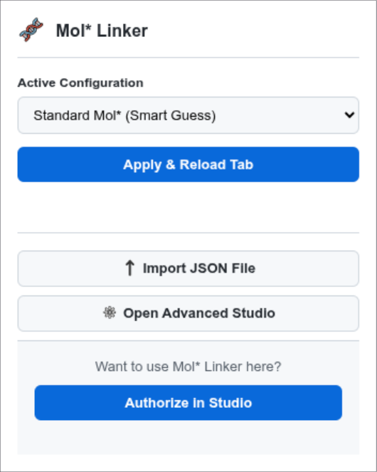
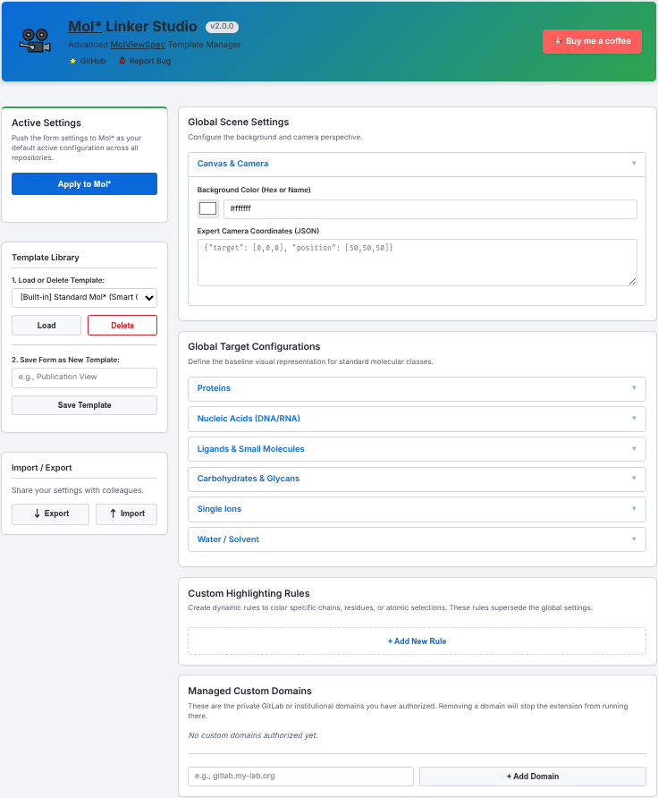

# Mol* Linker

[](#)
[](#)
  * [ ] [](#)

**Mol\* Linker** is a powerful browser extension for structural biologists, bioinformaticians, and developers. It instantly injects Mol* viewing capabilities directly into GitHub and GitLab, powered by a lightning-fast native Mol* architecture.


## Features

* **Native Integration:** Automatically detects `.pdb`, `.cif`, `.mmcif`, and `.gro` files on GitHub and GitLab and injects a 1-click Mol* viewing badge.
* **Mol\* Linker Studio:** A fully-featured Options dashboard to configure default representations, colors, and sizes for proteins, nucleic acids, ligands, lipids, and ions.
* **Turing-Complete Rule Engine:** Create dynamic highlighting rules to target specific chains, residue ranges, or atoms using MolScript logic.
* **Cinematic Control:** Inject custom camera coordinates, background canvas colors, hovering tooltips, and highly customizable floating 3D labels (control text size, text color, and borders) directly into the Mol* scene.
* **Exportable Templates:** Save your lab's preferred viewing configurations as `.json` files and share them with colleagues.
* **Cross-Browser:** Built on Manifest V3, fully compatible with Google Chrome, Microsoft Edge, Brave, and Mozilla Firefox.

## Installation

### Chrome / Edge / Brave
1. Visit the [Chrome Web Store link] *(Note: Add link after publishing)*.
2. Click **Add to Chrome**.

### Mozilla Firefox
1. Visit the [Firefox Add-ons link](https://addons.mozilla.org/fr/firefox/addon/mol-linker/).
2. Click **Add to Firefox**.

### Manual Installation (For Users)
1. Grab the [latest release](https://github.com/MartinBaGar/Molstar_Linker/releases/latest).
2. **Chrome:** Go to `chrome://extensions/`, enable **Developer mode**, and click **Load unpacked**. Select the unzipped folder.
3. **Firefox:** Go to `about:debugging#/runtime/this-firefox`, click **Load Temporary Add-on**, and select the `manifest.json` file.

## Usage Guide

### 1. The Quick Popup
Click the extension icon in your browser toolbar to quickly swap between built-in presets (e.g., "Protein Surface + Spacefill Ligands") or your own custom templates.



### 2. The Studio (Advanced Options)
Right-click the extension icon and select **Options** (or click "Open Advanced Studio" in the popup) to access the full rule builder.



* **Global Targets:** Set the baseline style for standard molecular classes.
* **Custom Rules:** Use the "Simple" mode to visually target specific chains/residues, or use "Expert" mode to write raw JSON for ultimate control.
* **Scene Settings:** Modify the canvas background color and default camera focus.

---

## Building from Source (For Developers & Store Reviewers)

This section contains the build instructions for compiling the original, unminified, and untranspiled TypeScript source code for Mol* Linker Studio (v3.0.0+). 

To verify this extension for add-on stores, you must compile the source code using the provided build scripts. This project uses **Pixi** (a package management tool) to ensure a perfectly reproducible Node.js environment.

### 1. Operating System & Build Environment Requirements
* **Operating System:** Cross-platform (Windows, macOS, or Linux)
* **Environment:** Pixi (which provisions the isolated Node.js environment automatically)

### 2. Required Software
You can use **Pixi** to build this extension. 
* **Installation:** Follow the official instructions at [https://pixi.sh/](https://pixi.sh/) (e.g., `curl -fsSL https://pixi.sh/install.sh | bash` on macOS/Linux).

*(Note: If you want to use npm exclusively on your own Node v18+ environment, simply strip `pixi run` from the following commands).*

### 3. Step-by-Step Build Instructions

Please follow these exact steps to reproduce the compiled extension:

1. **Extract the Source Code**
   Unzip the source code package into a local directory.

2. **Open your Terminal / Command Prompt**
   Navigate into the root of the extracted directory (where `pixi.toml` and `package.json` are located).

3. **Install Dependencies via Pixi**
   Run the following command. Pixi will automatically download the correct Node.js version in an isolated environment and install the NPM dependencies:
   ```bash
   pixi run npm install
   ```
4. **Execute the Build Script**
Run the following command to compile the TypeScript, bundle the code, and assemble the extension files:
``` sh
pixi run npm run build
```
(Note: Under the hood, this executes tsc --noEmit, node build.mjs, and node assemble.js firefox/chrome sequentially within the Pixi environment).

5. **Locate the Output**
Once the script finishes successfully, the compiled, ready-to-load extension files will be located in the newly generated `dist/firefox/` and `dist/chrome/` directories.

## Contributing
Contributions, issues, and feature requests are welcome! Feel free to check the issues page.

## TODO
- [ ] Make demo videos and screenshots
- [ ] Add example files
- [ ] Add link to wiki in the popup and studio page
- [ ] Add Chrome link when published
- [ ] Support RCSB files from the drop-down menu (currently not detected).

## Possible enhancements
- Add possibility to open local files using Mol* Linker and its presets.
- Allow use of custom host of Mol* instance.
